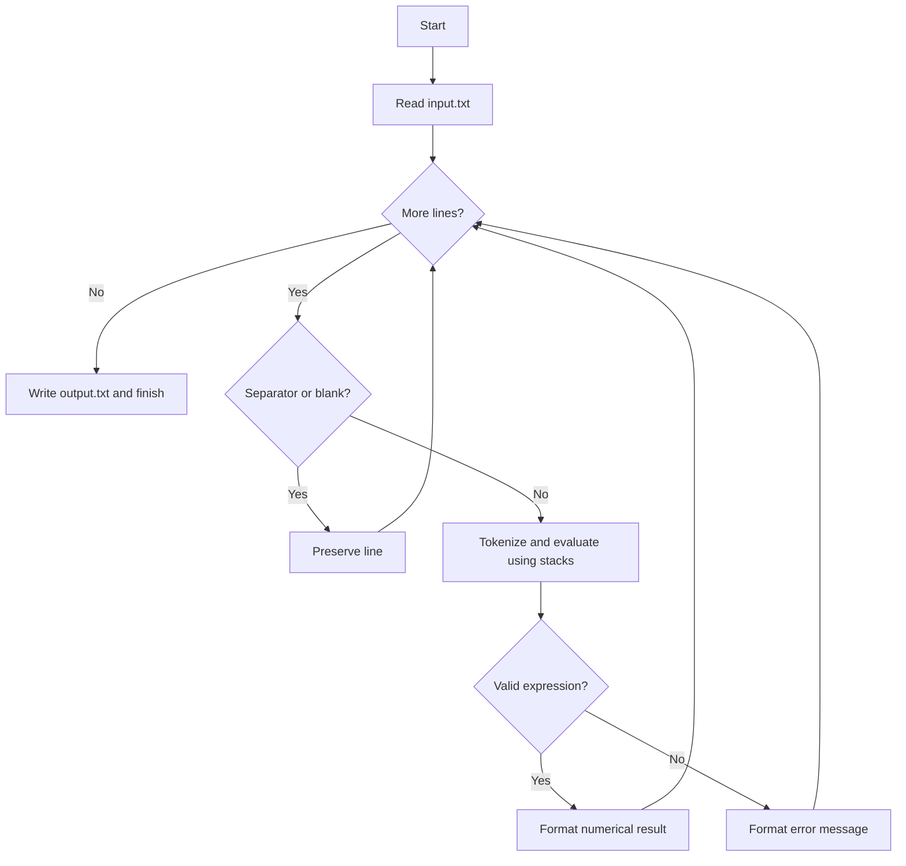

# Processing flowchart

```mermaid
flowchart TD
    A[Start] --> B[Read input.txt]
    B --> C{More lines?}
    C -- No --> H[Write output.txt and finish]
    C -- Yes --> D{Separator or blank?}
    D -- Yes --> E[Preserve line]
    D -- No --> F[Tokenize and evaluate using stacks]
    F --> G{Valid expression?}
    G -- Yes --> I[Format numerical result]
    G -- No --> J[Format error message]
    E --> C
    I --> C
    J --> C
```
